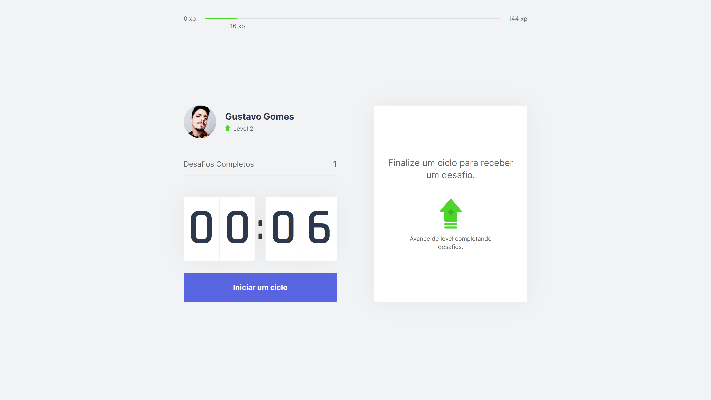
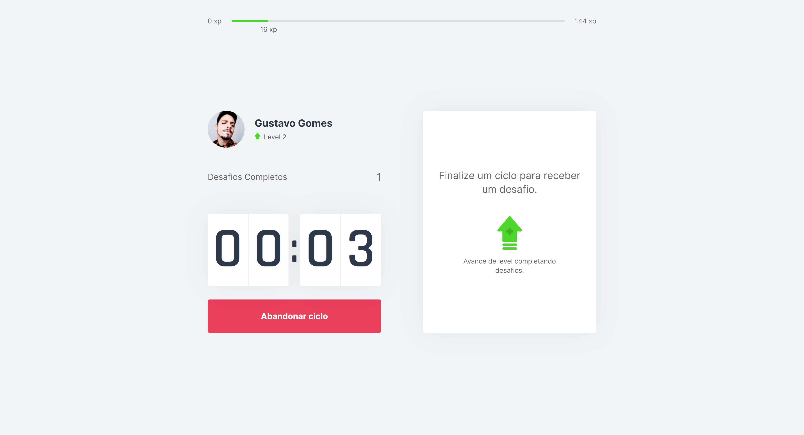
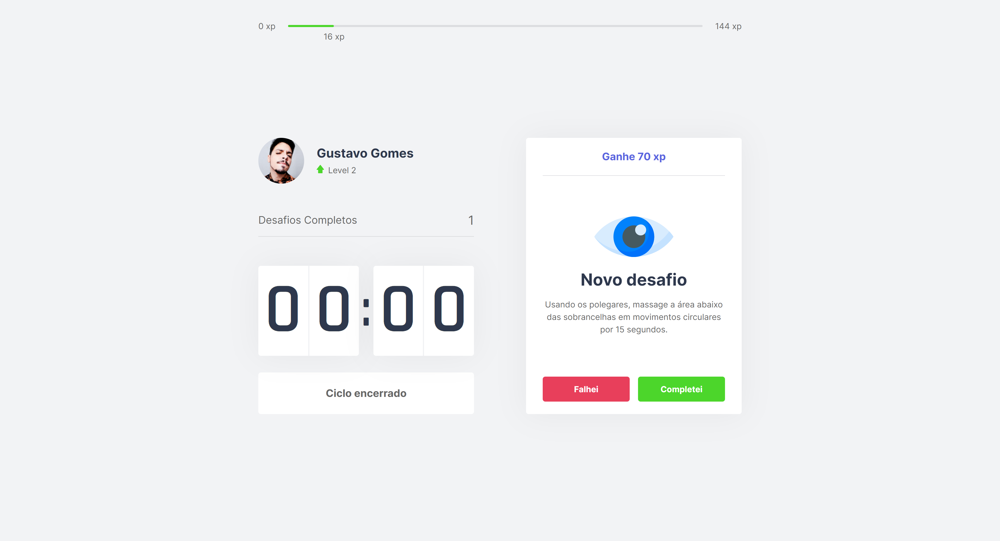
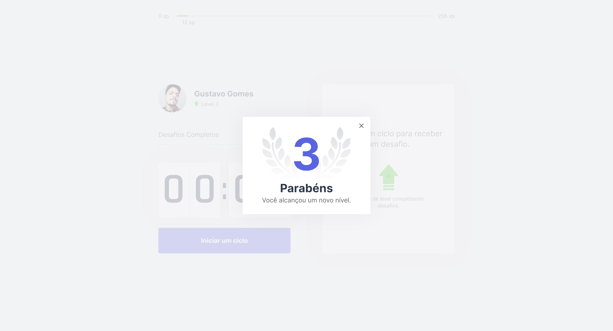

## :bookmark: Sobre

Sabemos que em uma época onde o home office prevalece, passamos maior parte do nosso dia sentados em frente ao computador em uma mesma posição, às vezes até mais do que as 8 horas de trabalho diárias.

E foi pensando nessas pessoas que o Move.it nasceu!

O **Move.It** é uma aplicação criada com o intuíto de motivar essas pessoas a se mexerem, fazendo mini exercícios durante um curto período de tempo e assim ganhando experiência (XP) dentro da plataforma.

O move.it usa como base a técnica de pomodoro, que consiste em você focar em uma tarefa durante um determiado tempo e após atingir esse tempo, você pode fazer uma pausa. A princípio o timer começa com ciclos de 25 minutos, após isso, um desafio é lançado para o usuário, em seguida, ele tem 2 opções, completar o desafio ou falhar. Caso complete, o usário ganhará experiência e consequentemente subirá de Nível, caso falhe, nenhum experiencia será ganha.

>Essa aplicação foi desenvolvida durante o evento **Next Level Week**, oferecido pela [Rocketseat](https://www.rocketseat.com.br).

## :rocket: Tecnologias

Essas são as tecnologias que foram utilizadas no desenvolvimento da aplicação.

- [VSCode](https://code.visualstudio.com/)
- [Yarn](https://classic.yarnpkg.com/)
- [React](https://reactjs.org/)
- [Next.JS](https://nextjs.org/)
- [Typescript](https://www.typescriptlang.org/)

## :computer: A aplicação

<div style="display: flex; align-items: 'center'; justify-content: space-evenly; margin-bottom: 20px">
  
  
</div>

<div style="display: flex; align-items: 'center'; justify-content: space-evenly">
  
  
</div>

## :construction_worker: Como rodar o projeto

```bash
# Clonar o repositório
$ git clone https://github.com/gustavohrgomes/move.it.git
```

### 💻 Executando o projeto
```bash
# Navegue até a pasta do projeto
$ cd moveit

# Instale as dependecias
# NPM
$ npm install

# Yarn
$ yarn

# Execute a aplicação 
# NPM
$ npm dev

# Yarn
$ yarn dev
```

Navegue http://localhost:3000/ no seu navegador para ver os resultados.

## :memo: Features a serem implementadas
[ ] Login com Github
[ ] Sistema de Leaderboard
[ ] Compartilhar avanço de nível no twitter
[ ] Melhorar Estilização
